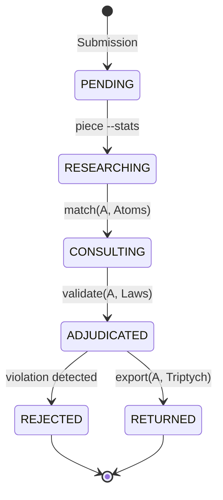

# Escrow Protocol (The Adjudication Loop)

This derivation formalizes the transition of abstractions through the Escrow Satellite. It defines the mechanism by which operational patterns from the Triptych are validated against the 4 Laws and returned as Natural Law Decisions.

## Logic (IS)

**Primitive vocabulary:**

- `A` — an abstraction (the candidate for adjudication)
- `E` — the Escrow Satellite (the formal system `system-system--system`)
- `T` — the Triptych (Body + Mind + Seed)
- `R(A, T)` — Research function: returns the set of implementations of `A` in `T`
- `C(A, E)` — Consultation function: returns the set of formal atoms in `E` that constrain `A`
- `D(A)` — Decision function: the result of the adjudication
- `σ_E` — the scale of the Escrow (meta-scale)

**Axioms:**

**A-EP-01 (Escrow Existence).** Every abstraction `A` that claims universal applicability must pass through the Escrow `E` before being formalized in the Triptych `T`.

**A-EP-02 (Research Completeness).** The adjudication of `A` is ill-founded unless `R(A, T)` is non-empty. We do not adjudicate abstractions that have no operational footprint.

**A-EP-03 (Natural Law Primacy).** If `A` violates any Law `L` in `E`, the decision `D(A)` is a `REJECTION`. No operational utility can override formal law.

**A-EP-04 (Return Invariant).** A returned abstraction `G(σ, θ)` must be structurally identical to its formal piece in `E`, differing only in the parameter path `θ` rendered at scale `σ`.

---

## Mathematics (MUST)

**Theorem EP-1 (Adjudication Convergence).** The adjudication loop converges if and only if the abstraction `A` can be mapped to a parameter vector `θ` that satisfies the constraint function `C(σ_E)`.

*Proof.* Let `A` be an abstraction. `A` is rendered at the meta-scale `σ_E`. By URT (Universal Rendering Thesis), `A = G(σ_E, θ_A)`. The adjudication loop tests if `θ_A ∈ C(σ_E)`. 
- If `θ_A ∉ C(σ_E)`, then `A` is non-renderable at the formal scale and must be rejected. 
- If `θ_A ∈ C(σ_E)`, then `A` is a valid formal piece.
The "return" to the Triptych is the rendering `A_T = G(σ_T, θ_A)` where `σ_T` is the operational scale. Since `G` is scale-invariant (Law 4), the structure is preserved. ∎

---

## Algorithm (COMPUTE)

The protocol is implemented as a 4-state state machine:

### The Adjudication Formula

$$\text{Escrow}(A) = \begin{cases} \text{REJECT} & \text{if } \exists L \in \text{Laws} : A \vdash \neg L \\ \text{RETURN}(A, \sigma_T) & \text{if } \forall L \in \text{Laws} : A \vdash L \end{cases}$$

---

## What This Resolves

- **The Stale Path Problem**: By formalizing the path in $sys.toml$, the protocol ensures the Escrow always knows where the Triptych lives.
- **The Ideal/Natural Law Gap**: Adjudication is the explicit bridge. It forces the "human" abstraction to survive the "natural" law.
- **The Escrow Satellite Return**: the "RETURN" state is the physical write-back of the validated logic into the operational repos.
